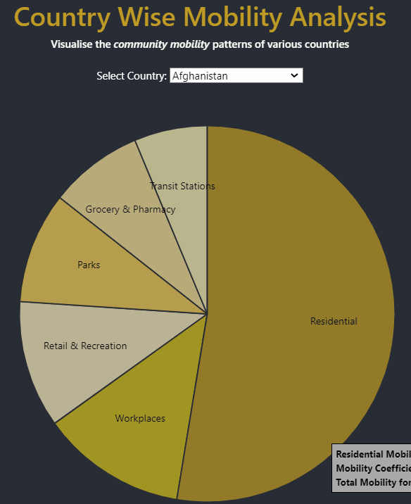

# CSE-6242: Data & Visual Analytics 

# HACI: Holistic Analysis of Covid-19 Impacts

The ‘HACI’ (Holistic Analysis of Covid-19 Impacts) Dashboard aims to highlight and quantify the disparities in how the pandemic affected the world by calculating a cumulative score of the impact of covid on each country, derived by analyzing and visualizing the global economic, social, environmental and health impacts of Covid-19. 

These impacts have been analysed and visualised across the following caterogies:
- Covid Severity
- Economy
- Government
- Mobility
- Symptoms
- Vaccination

# Data
[Google COVID-19 Open Data Repository](https://health.google.com/covid-19/open-data/)

This data repository is one of the most comprehensive collections of up-to-date COVID-19-related information. Comprising of data from more than twenty thousand locations worldwide, it contains a rich variety of data types to help public health professionals, researchers and policymakers in understanding and managing the virus.

__Size:__  The size of the aggregated dataset is ~22.52 GB, pre-processing.

The processed and aggregated data used to develop the HACI dashboard can be found in the [/data](https://github.gatech.edu/asadhukha3/HACI/tree/main/data) folder of this project.

# Installation Instructions
To install the application locally:

- Clone the git repository `git clone https://github.gatech.edu/asadhukha3/HACI.git`
- Use Python version 3.7 or higher
- Run `pip install -r requirements.txt` to install the required dependencies
- Run the following command in the app's directory to run the webapp locally `python app.py`
- Go to http://127.0.0.1:5000/ to view the application

# Demo Video
- [HACI Dashboard Demo](www.youtube.com) can be viewed to grasp a brief understanding on how one may leverage this dashboard

# Interacting with the HACI Dashboard
The dashboard explores the impacts of Covid-19 through 6 main categories _(Covid Severity, Economy, Government, Mobility,Symptoms, Vaccination)_, each having a corresponding tab containing the relevant data and visualisations.

The analysis, visualisations and inferences for each catergory is contained within the [/templates](https://github.gatech.edu/asadhukha3/HACI/tree/main/templates) folder.

## Covid Severity:
Based on a Covid Severity Index that calculates a cummulative score which is a function of the number of cases, number of deaths, vaccination count and mortality rate. 

The below choropleth dipicts the _Covid Severity Index_ for various countries across the world

## Economy
Basec on world economy data, we can see in the scatter plot below how the _Vaccination Index_ and _Covid Severity_ change with the GDP of the countries of the world.

## Government Stringency
The stringency in various government policies (such as cancelling public events, internation travel control, etc) is visualised correlation to the Covid Severity Index 

## Mobility
The community movement of people concerning 6 specific catergories _(retail and recreation spaces, grocercy and pharmacy stores, parks, transit stations, workplaces and residential areas)_ across the various countries of the world.

The data shows how visits to public spaces are changing in each geographic region.

## Symptoms
The Google Search trends can be visualised in the form of a word cloud across the 3 strains: _Alpha_, _Delta_ and _Omicron_

The search trends regarding symptoms are depicted as a function of the relative search frequency over time

## Vaccination
The below plots show the breakdown of covid severity into two timelines; Pre-vaccination and post-vaccination. It can be seen how the change in COVID severity before and after vaccination availability differs. The graph also shows a general best fit line to easily communicate if there was an upward or a downward trend in the covid severity post/pre vaccination.

## Developed By:
- Adarsh Sadhukha (asadhukha3)
- Nidhi Koundinya (nkoundinya3)
- Palak Aggarwal (paggarwal39)
- Schezeen Fazulbhoy (sfazulbhoy3)
- Upaasana Krishnan (ukrishnan3) 
- Vatsal Goyal (vvatsal6)

